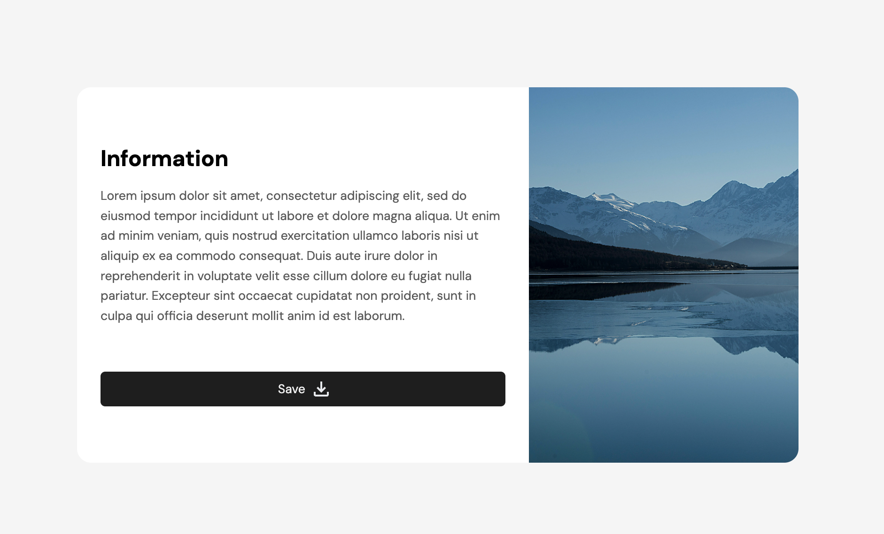
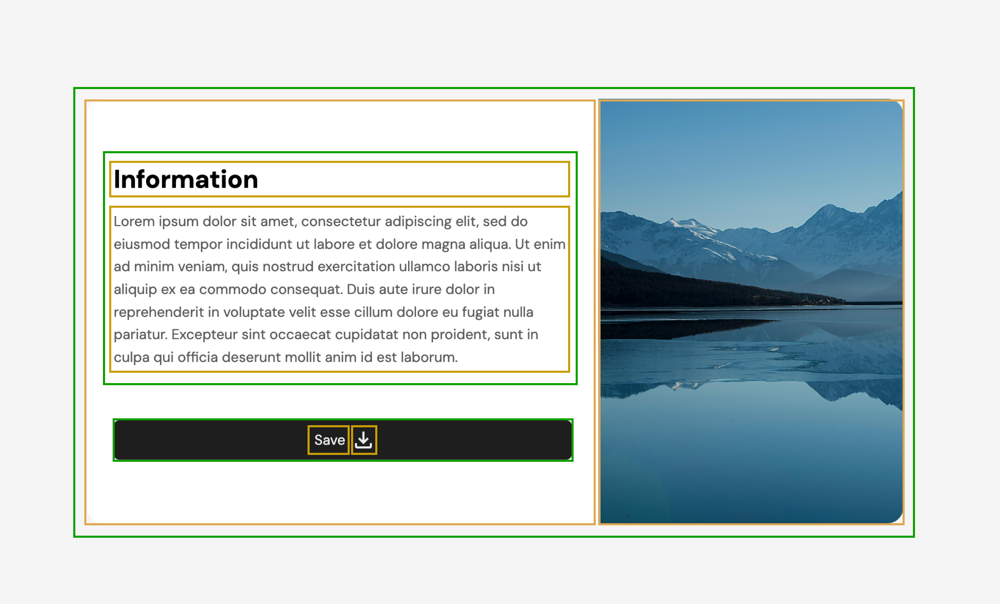

# Basic Card Component

## Getting started

Your goal is to recreate the following screen using HTML and CSS.

Some basic details:

- Background color is `rgb(245, 245, 245)`.
- The font used is **DM Sans**, which is accessible on **[Google Fonts](https://fonts.google.com/)**.
- The **Information** header (`font-size: 18pt; color: rgb(30, 30, 30);`)
- Image and icon is included in **assets** folder.
- Body text (`font-size: 10pt; line-height: 1.6; color: rgb(90, 90, 90);`)

If you are stuck, you may want to take a look at the reference solution in the **solutions** folder.

### Some helpful information

- [Adding and using Google Fonts](https://www.w3schools.com/css/css_font_google.asp)
- [CSS Flexbox](https://www.w3schools.com/css/css3_flexbox.asp) — for displaying elements in side-by-side yet
  collapsible form.

### Challenges

- A challenge with working on the web is catering to many different screen sizes.
  See if you can support mobile or smaller screens, e.g., as shown in the view below.
  You may want to take a look at [CSS media queries](https://www.w3schools.com/css/css_rwd_mediaqueries.asp).

- Add interactive effects, e.g., altering the color of the button on mouse hover.
  You may want to take a look a [CSS transition effects](https://www.w3schools.com/css/css3_transitions.asp).

- Don't use the HTML code provided — see if you can come up with a similar solution from scratch.
  The general structure is outlined below: 