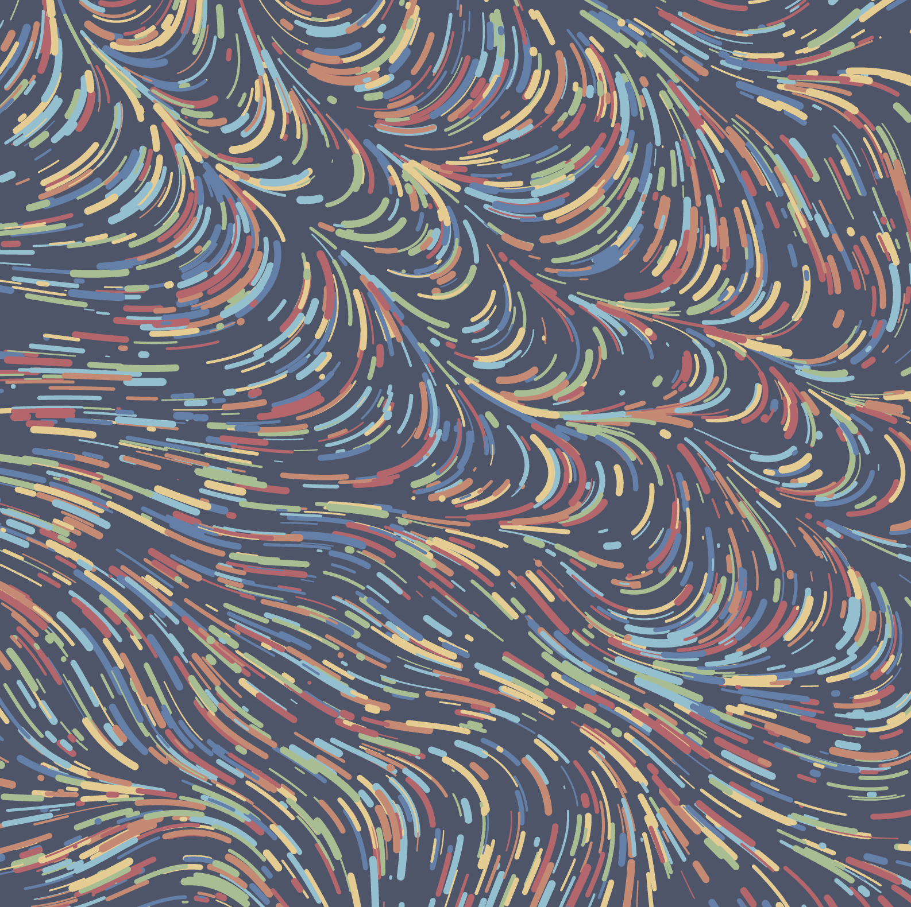
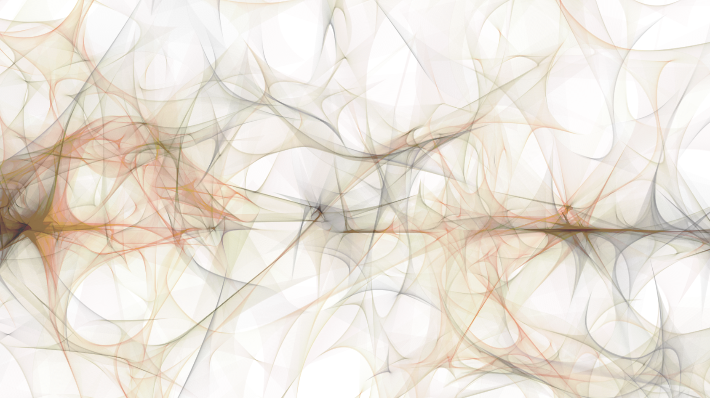

# Generative art

You may want to explore using other libraries for generative art. Notably, [p5.js](https://p5js.org/)
and [d3.js](https://d3js.org/).
Some exploration suggestions:

- [Perlin noise flow field](https://thecodingtrain.com/challenges/24-perlin-noise-flow-field)
- [OpenProcessing](https://openprocessing.org/)
- [Coding Train challenges](https://thecodingtrain.com/challenges)

p5.js resources: [Official site](https://p5js.org/), [OpenProcessing](https://openprocessing.org/)

d3.js resources: [D3 in Depth](https://www.d3indepth.com/), [Observable](https://observablehq.com/)

## Inspiration

