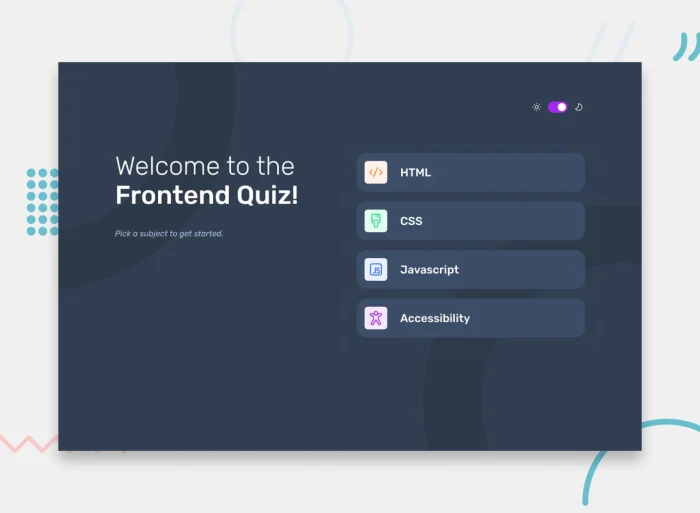
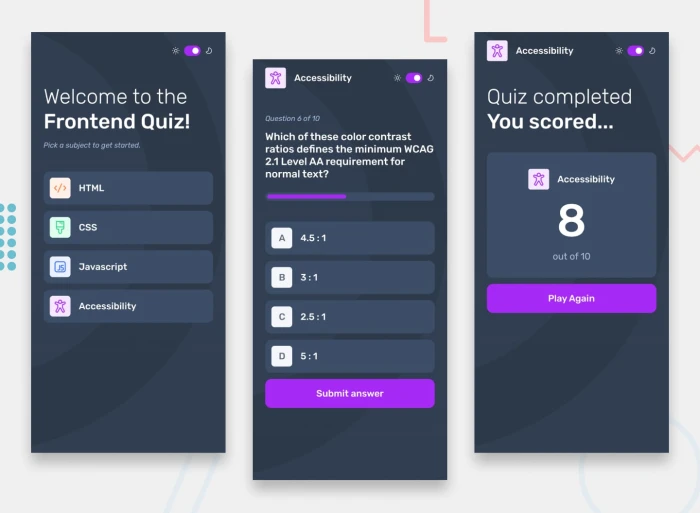

# Quiz app

Your goal is to implement [this design](https://www.frontendmentor.io/challenges/frontend-quiz-app-BE7xkzXQnU) from
FrontendMentor. Create a fully-functional quiz app that tests the user based on a given set of questions.

You may want to explore:

- Create a math quiz app — include equation typesetting with [KaTeX](https://katex.org/)
- Light and dark mode
- Responsive layout — designing with mobile, tablet, and desktop in mind.
- Customization — allow users to choose color scheme.
- [JSON](https://developer.mozilla.org/en-US/docs/Learn/JavaScript/Objects/JSON) (JavaScript Object Notation) — storing
  questions and solutions in a more standardized object format.

You can see a working example [here](https://chjus.github.io/Introduction-to-HTML-CSS-and-JS/solutions/quiz-app.html).

### Hard challenge

- Create a global leaderboard for your quiz based on user time and accuracy. You will need to explore
  **backend server-side development** and **database** technology.
- Allow users to log in to your site and create their own shareable quizzes with customizable options.
- Reference: [server-side programming](https://developer.mozilla.org/en-US/docs/Learn/Server-side)